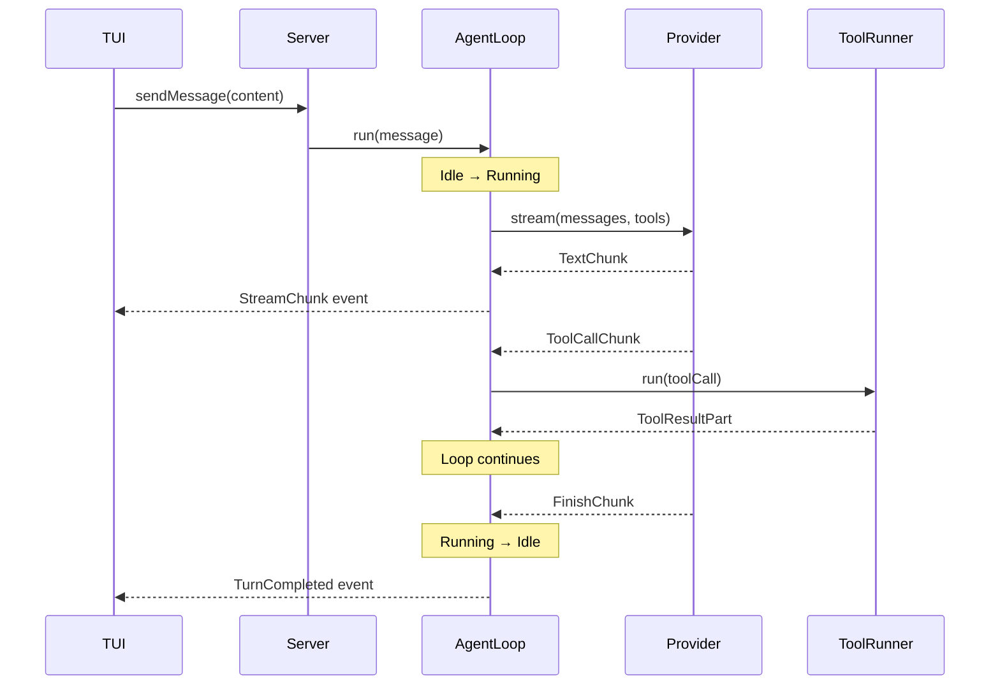
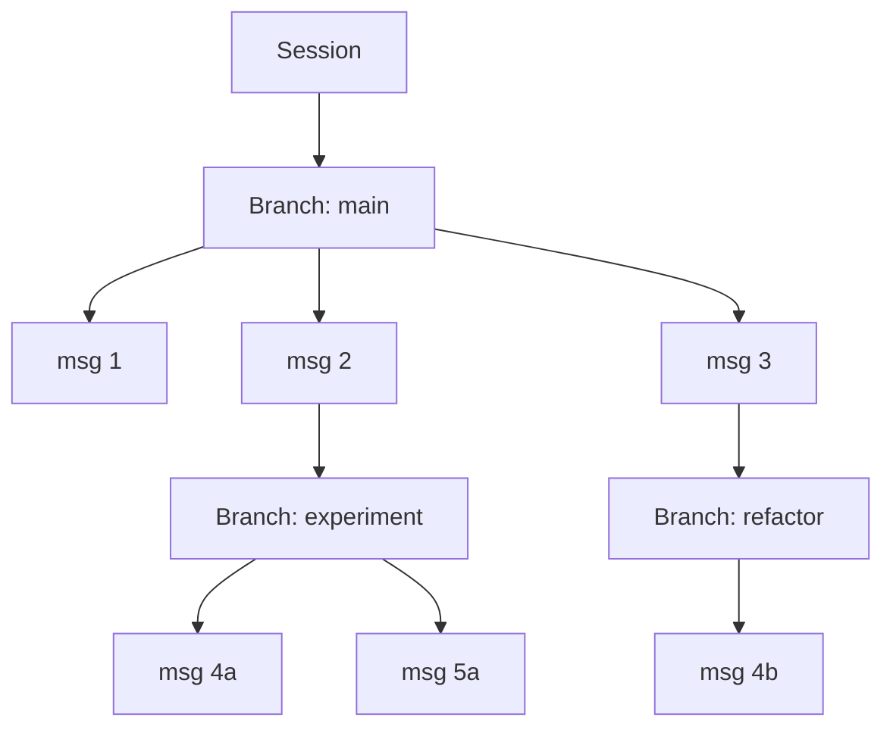
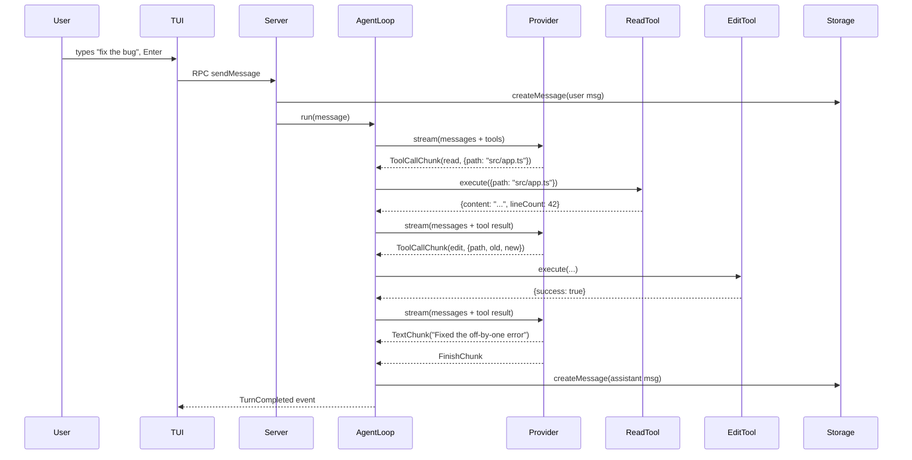

# Gent

Minimal, opinionated agent harness

<div class="pt-6 text-gray-400">
Built with Effect · BEAM-inspired actors · Local-first
</div>

<div class="abs-br m-6 text-sm opacity-50">
@cevr
</div>

---

## layout: center

# Philosophy

<v-clicks>

**Minimal** — Small surface area, entire codebase understandable

**Opinionated** — One way to do things, no configuration bloat

**Built with Effect** — Services, Layers, Schema, Stream, Ref

</v-clicks>

---

# Architecture

```
TUI (@opentui/solid) ←── SSE ──→ Server (HttpApi)
                                      │
                              ┌───────▼───────┐
                              │    Runtime     │
                              │  AgentLoop     │
                              │  AgentActor    │
                              │  EventStore    │
                              └───────┬───────┘
                                      │
              ┌───────────────────────┼───────────────────────┐
              │                       │                       │
        ┌─────▼─────┐          ┌─────▼─────┐          ┌─────▼─────┐
        │  Storage   │          │   Tools   │          │ Providers │
        │  SQLite    │          │  Effect   │          │  ai-sdk   │
        └───────────┘          │ Services  │          └───────────┘
                               └───────────┘
```

<v-click>

**9 packages + 2 apps · ~34k lines total**

</v-click>

---

# Package Map

| Package            | Purpose                                                |
| ------------------ | ------------------------------------------------------ |
| `@gent/core`       | Message schemas, Tool abstraction, Events, Permissions |
| `@gent/runtime`    | AgentLoop state machine, ToolRunner, Retry logic       |
| `@gent/storage`    | SQLite persistence (bun:sqlite)                        |
| `@gent/providers`  | Vercel AI SDK adapter, stream chunking                 |
| `@gent/tools`      | 12 concrete tools (Read, Write, Bash, Glob, ...)       |
| `@gent/server`     | GentCore business logic, RPC handlers                  |
| `@gent/sdk`        | RPC client, message utilities                          |
| `@gent/test-utils` | SequenceRecorder, mock layers                          |
| `@gent/atom-solid` | Reactive atoms for Solid.js                            |

<v-click>

| App           | Purpose                        |
| ------------- | ------------------------------ |
| `apps/tui`    | Terminal UI via @opentui/solid |
| `apps/server` | BunHttpServer + SSE            |

</v-click>

---

## layout: section

# Part 1: Core Types

The schema foundation everything is built on

---

# Message Parts — Discriminated Union

Every message is composed of typed parts

```ts {all|1-3|5-9|11-15|17-21|all}
// packages/core/src/message.ts

// Text
export class TextPart extends Schema.Class<TextPart>("TextPart")({
  type: Schema.Literal("text"),
  text: Schema.String,
}) {}

// Tool calls
export class ToolCallPart extends Schema.Class<ToolCallPart>("ToolCallPart")({
  type: Schema.Literal("tool-call"),
  toolCallId: Schema.String,
  toolName: Schema.String,
  input: Schema.Unknown, // decoded at tool execute time
}) {}

// Tool results
export class ToolResultPart extends Schema.Class<ToolResultPart>("ToolResultPart")({
  type: Schema.Literal("tool-result"),
  toolCallId: Schema.String,
  toolName: Schema.String,
  output: Schema.Struct({ type: Schema.Literal("json", "error-json"), value: Schema.Unknown }),
}) {}
```

---

# Message Schema

Parts compose into Messages, Messages belong to Sessions & Branches

```ts
// packages/core/src/message.ts

export const MessagePart = Schema.Union(
  TextPart,
  ImagePart,
  ToolCallPart,
  ToolResultPart,
  ReasoningPart,
)

export class Message extends Schema.Class<Message>("Message")({
  id: Schema.String,
  sessionId: Schema.String,
  branchId: Schema.String,
  kind: Schema.optional(Schema.Literal("regular", "interjection")),
  role: Schema.Literal("user", "assistant", "system", "tool"),
  parts: Schema.Array(MessagePart),
  createdAt: Schema.DateFromNumber,
  turnDurationMs: Schema.optional(Schema.Number),
}) {}
```

<v-click>

```ts
export class Session extends Schema.Class<Session>("Session")({
  id: Schema.String,
  name: Schema.optional(Schema.String),
  cwd: Schema.optional(Schema.String),
  bypass: Schema.optional(Schema.Boolean),
  createdAt: Schema.DateFromNumber,
  updatedAt: Schema.DateFromNumber,
}) {}

export class Branch extends Schema.Class<Branch>("Branch")({
  id: Schema.String,
  sessionId: Schema.String,
  parentBranchId: Schema.optional(Schema.String),
  parentMessageId: Schema.optional(Schema.String),
  createdAt: Schema.DateFromNumber,
}) {}
```

</v-click>

---

# Event System — 27 Event Types

Every state change is an event. Typed via `Schema.TaggedClass`.

```ts {all|1-4|6-9|11-16|all}
// packages/core/src/event.ts

export class StreamStarted extends Schema.TaggedClass<StreamStarted>()("StreamStarted", {
  sessionId: Schema.String,
  branchId: Schema.String,
}) {}

export class StreamChunk extends Schema.TaggedClass<StreamChunk>()("StreamChunk", {
  sessionId: Schema.String,
  branchId: Schema.String,
  chunk: Schema.String,
}) {}

export class ToolCallStarted extends Schema.TaggedClass<ToolCallStarted>()("ToolCallStarted", {
  sessionId: Schema.String,
  branchId: Schema.String,
  toolCallId: Schema.String,
  toolName: Schema.String,
  input: Schema.optional(Schema.Unknown),
}) {}
```

<v-click>

```ts
// Union of all 27 event types
export const AgentEvent = Schema.Union(
  SessionStarted,
  SessionEnded,
  MessageReceived,
  StreamStarted,
  StreamChunk,
  StreamEnded,
  TurnCompleted,
  ToolCallStarted,
  ToolCallCompleted,
  PermissionRequested,
  PlanPresented,
  PlanConfirmed,
  PlanRejected,
  CompactionStarted,
  CompactionCompleted,
  ErrorOccurred,
  MachineInspected,
  MachineTaskSucceeded,
  MachineTaskFailed,
  TodoUpdated,
  QuestionsAsked,
  QuestionsAnswered,
  SessionNameUpdated,
  BranchCreated,
  BranchSwitched,
  BranchSummarized,
  AgentSwitched,
  SubagentSpawned,
  SubagentCompleted,
)
```

</v-click>

---

# EventStore — PubSub + Append-Only Log

In-memory PubSub with replay for late subscribers

```ts {all|5-6|8-16|18-30|all}
// packages/core/src/event.ts

export class EventStore extends Context.Tag("@gent/core/src/event/EventStore")<...>() {
  static Live: Layer.Layer<EventStore> = Layer.scoped(EventStore,
    Effect.gen(function* () {
      const pubsub = yield* PubSub.unbounded<EventEnvelope>()
      const eventsRef = yield* Ref.make<EventEnvelope[]>([])
      const idRef = yield* Ref.make(0)

      return {
        publish: Effect.fn("EventStore.publish")(function* (event) {
          const id = yield* Ref.modify(idRef, (n) => [n + 1, n + 1])
          const envelope = new EventEnvelope({ id: id as EventId, event, createdAt: Date.now() })
          yield* Ref.update(eventsRef, (events) => [...events, envelope])
          yield* PubSub.publish(pubsub, envelope)
        }),

        subscribe: ({ sessionId, branchId, after }) =>
          Stream.unwrapScoped(Effect.gen(function* () {
            const queue = yield* PubSub.subscribe(pubsub)
            const afterId = after ?? (0 as EventId)
            const latestId = yield* Ref.get(idRef)
            // Replay buffered events
            const buffered = (yield* Ref.get(eventsRef))
              .filter((env) => env.id > afterId && env.id <= latestId
                && matchesEventFilter(env, sessionId, branchId))
            // Then live stream
            const live = Stream.fromQueue(queue).pipe(
              Stream.filter((env) => env.id > latestId
                && matchesEventFilter(env, sessionId, branchId)))
            return Stream.concat(Stream.fromIterable(buffered), live)
          })),
      }
    }),
  )
}
```

---

## layout: section

# Part 2: Agents & the Loop

The execution engine

---

# Agent Definitions

6 built-in agents. Model is per-agent, not user-configurable.

```ts {all|1-6|8-17|19-24|all}
// packages/core/src/agent.ts

export const AgentName = Schema.Literal(
  "cowork",
  "deepwork", // primary (user-facing)
  "explore",
  "architect", // subagent (delegated)
  "compaction",
  "title", // system (hidden)
)

export const Agents = {
  cowork: defineAgent({
    name: "cowork",
    kind: "primary",
    canDelegateToAgents: ["explore", "architect"],
    systemPromptAddendum: "Cowork agent. Fast, practical, execute changes. Minimal prose.",
  }),

  deepwork: defineAgent({
    name: "deepwork",
    kind: "primary",
    canDelegateToAgents: ["explore", "architect"],
    reasoningEffort: "high",
    systemPromptAddendum: "Deepwork agent. Thorough analysis, careful tradeoffs.",
  }),

  explore: defineAgent({
    name: "explore",
    kind: "subagent",
    allowedTools: ["read", "grep", "glob", "bash"],
  }),
}
```

<v-click>

```ts
export const AgentModels: Record<AgentName, ModelId> = {
  cowork: "anthropic/claude-opus-4-5" as ModelId,
  deepwork: "openai/gpt-5.2-codex" as ModelId,
  explore: "anthropic/claude-3-5-haiku-20241022" as ModelId,
  // ...
}
```

</v-click>

---

# AgentLoop — The State Machine

effect-machine actor: **Idle → Running → Interrupted**

```ts {all|1-5|7-10|12-20|all}
// packages/runtime/src/agent/agent-loop.ts

const AgentLoopState = State({
  Idle: {},
  Running: { message: Message, bypass: Schema.Boolean },
  Interrupted: { sessionId: Schema.String, branchId: Schema.String },
})

const AgentLoopEvent = Event({
  Start: { message: Message, bypass: Schema.UndefinedOr(Schema.Boolean) },
  Completed: { interrupted: Schema.Boolean, sessionId: Schema.String, branchId: Schema.String },
  Failed: { error: Schema.String },
})

// Steering commands
export const SteerCommand = Schema.Union(
  Schema.TaggedStruct("Cancel", SteerTargetFields),
  Schema.TaggedStruct("Interrupt", SteerTargetFields),
  Schema.TaggedStruct("Interject", { ...SteerTargetFields, message: Schema.String }),
  Schema.TaggedStruct("SwitchAgent", { ...SteerTargetFields, agent: AgentName }),
)
```

<v-click>

```ts
// Service interface
export interface AgentLoopService {
  readonly run: (
    message: Message,
    options?: { bypass?: boolean },
  ) => Effect.Effect<void, AgentLoopError>
  readonly steer: (command: SteerCommand) => Effect.Effect<void>
  readonly followUp: (message: Message) => Effect.Effect<void, AgentLoopError>
  readonly isRunning: (input: { sessionId: string; branchId: string }) => Effect.Effect<boolean>
}
```

</v-click>

---

# AgentLoop — Layer Dependencies

The Live layer declares its exact requirements via Effect's type system

```ts
// packages/runtime/src/agent/agent-loop.ts

export class AgentLoop extends Context.Tag("@gent/runtime/.../AgentLoop")<...>() {
  static Live = (config: { systemPrompt: string }): Layer.Layer<
    AgentLoop,        // provides
    never,            // no construction errors
    | Storage         // requires ↓
    | Provider
    | ToolRegistry
    | AgentRegistry
    | EventStore
    | CheckpointService
    | FileSystem.FileSystem
    | ToolRunner
  > => Layer.effect(AgentLoop, Effect.gen(function* () {
      const storage = yield* Storage
      const provider = yield* Provider
      const toolRegistry = yield* ToolRegistry
      const agentRegistry = yield* AgentRegistry
      const eventStore = yield* EventStore
      // ... all services resolved from context
    }))
}
```

<v-click>

**Key insight:** The type system enforces every dependency is provided at composition time. Missing a service = compile error, not runtime crash.

</v-click>

---

# AgentLoop — Execution Cycle



---

# runLoop — Recursive Generator

The core loop: stream from provider, handle chunks, recurse on tool calls

```ts {all|1-6|8-14|16-26|all}
// packages/runtime/src/agent/agent-loop.ts (simplified)

const runLoop: (...) => Effect<boolean, ...> =
  Effect.fn("AgentLoop.runLoop")(function* (initialMessage, bypass) {
    const agentName = yield* resolveCurrentAgent()
    const agent = yield* agentRegistry.get(agentName)
    const modelId = resolveAgentModelId(agentName)

    // Build messages with checkpoint context
    const messages = yield* buildMessages(sessionId, branchId)

    // Stream from provider with retry
    const stream = yield* withRetry(
      provider.stream({ messages, tools, model: modelId, ... }),
      agent
    )

    // Process each chunk
    yield* Stream.runForEach(stream, (chunk) =>
      Effect.gen(function* () {
        if (chunk._tag === "TextChunk") {
          yield* publishEvent(new EventStreamChunk({ chunk: chunk.text, ... }))
        }
        if (chunk._tag === "ToolCallChunk") {
          const result = yield* executeToolCall(chunk, bypass)
          // result becomes part of next message → loop recurses
        }
        if (chunk._tag === "FinishChunk") {
          yield* publishEvent(new TurnCompleted({ durationMs, ... }))
        }
      })
    )
  })
```

---

## layout: section

# Part 3: Tools

Effect services with typed params

---

# Tool Definition Pattern

`defineTool` — schema params, Effect execute, full traceability

```ts {all|1-5|7-13|15-22|all}
// packages/core/src/tool.ts

export interface ToolDefinition<Name, Params, Result, Error, Deps> {
  readonly name: Name
  readonly description: string
  readonly params: Params // Schema for input validation
  readonly execute: (
    params: Schema.Schema.Type<Params>,
    ctx: ToolContext,
  ) => Effect.Effect<Result, Error, Deps>
}

export interface ToolContext {
  readonly sessionId: string
  readonly branchId: string
  readonly toolCallId: string
  readonly agentName?: AgentName
}

// Factory (identity function for inference)
export const defineTool = <Name, Params, Result, Error, Deps>(
  definition: ToolDefinition<Name, Params, Result, Error, Deps>,
) => definition
```

---

# Concrete Tool: Read

Full example — error type, params schema, Effect-based execute

```ts {all|1-5|7-15|17-26|28-37|all}
// packages/tools/src/read.ts

export class ReadError extends Schema.TaggedError<ReadError>()("ReadError", {
  message: Schema.String,
  path: Schema.String,
  cause: Schema.optional(Schema.Unknown),
}) {}

export const ReadParams = Schema.Struct({
  path: Schema.String.annotations({
    description: "Absolute path to file to read",
  }),
  offset: Schema.optional(
    Schema.Number.annotations({
      description: "Line number to start reading from (1-indexed)",
    }),
  ),
  limit: Schema.optional(
    Schema.Number.annotations({
      description: "Maximum number of lines to read",
    }),
  ),
})

export const ReadTool = defineTool({
  name: "read",
  concurrency: "parallel",
  description: "Read file contents. Returns numbered lines.",
  params: ReadParams,
  execute: Effect.fn("ReadTool.execute")(function* (params) {
    const fs = yield* FileSystem.FileSystem
    const path = yield* Path.Path

    const filePath = path.resolve(params.path)
    const content = yield* fs.readFileString(filePath).pipe(
      Effect.mapError(
        (e) =>
          new ReadError({
            message: `Failed to read file: ${e.message}`,
            path: filePath,
            cause: e,
          }),
      ),
    )
    // ... format with line numbers, apply offset/limit
    return { content: numberedContent, path: filePath, lineCount, truncated }
  }),
})
```

---

# All 12 Tools

| Tool            | Concurrency | Purpose                              |
| --------------- | ----------- | ------------------------------------ |
| `read`          | parallel    | Read file with line numbers          |
| `write`         | serial      | Create new file                      |
| `edit`          | serial      | Structured file edits (unified diff) |
| `bash`          | serial      | Shell commands with timeout          |
| `glob`          | parallel    | Fast pattern matching                |
| `grep`          | parallel    | Regex search (ripgrep-based)         |
| `plan`          | serial      | Present plan → await user confirm    |
| `ask-user`      | serial      | Clarifying questions                 |
| `repo-explorer` | parallel    | External repo exploration            |
| `todo`          | serial      | Task list CRUD                       |
| `webfetch`      | parallel    | HTTP fetch + content processing      |
| `task`          | serial      | Interactive task management          |

<v-click>

**Adding a new tool:**

```ts
export const MyTool = defineTool({
  name: "my-tool",
  description: "...",
  params: Schema.Struct({ ... }),
  execute: Effect.fn("MyTool.execute")(function* (params) {
    // yield* any Effect service
    return result
  }),
})
```

Then register: `ToolRegistry.Live([...allTools, MyTool])`

</v-click>

---

# Tool Registry — Context.Tag Service

```ts {all|1-7|9-17|19-23|all}
// packages/core/src/tool.ts

export interface ToolRegistryService {
  readonly get: (name: string) => Effect<AnyToolDefinition | undefined>
  readonly list: () => Effect<ReadonlyArray<AnyToolDefinition>>
  readonly register: (tool: AnyToolDefinition) => Effect<void>
}

export class ToolRegistry extends Context.Tag("@gent/core/.../ToolRegistry")<...>() {
  static Live = (tools: ReadonlyArray<AnyToolDefinition>): Layer.Layer<ToolRegistry> =>
    Layer.succeed(ToolRegistry, (() => {
      const toolMap = new Map(tools.map((t) => [t.name, t]))
      return {
        get: (name) => Effect.succeed(toolMap.get(name)),
        list: () => Effect.succeed([...toolMap.values()]),
        register: (tool) => Effect.sync(() => { toolMap.set(tool.name, tool) }),
      }
    })())

  // Test stub — no tools registered
  static Test = (): Layer.Layer<ToolRegistry> =>
    Layer.succeed(ToolRegistry, {
      get: () => Effect.succeed(undefined),
      list: () => Effect.succeed([]),
      register: () => Effect.void,
    })
}
```

<v-click>

**Pattern:** Every service has `Live` + `Test` layers. Swap at composition time.

</v-click>

---

## layout: section

# Part 4: Providers

Model-agnostic AI SDK bridge

---

# Provider Service

Vercel AI SDK wrapper — `Stream.async` bridges async iterators to Effect streams

```ts
// packages/providers/src/provider.ts

export interface ProviderService {
  readonly stream: (
    request: ProviderRequest,
  ) => Effect<Stream<StreamChunk, ProviderError>, ProviderError>

  readonly generate: (request: GenerateRequest) => Effect<string, ProviderError>
}
```

<v-click>

**Stream chunk types:**

```ts
export class TextChunk {
  text: string
}
export class ToolCallChunk {
  toolCallId: string
  toolName: string
  input: unknown
}
export class ReasoningChunk {
  text: string
}
export class FinishChunk {
  finishReason: string
  usage?: Usage
}
```

</v-click>

<v-click>

**Model format:** `provider/model`

```ts
"anthropic/claude-opus-4-5"
"openai/gpt-5.2-codex"
"anthropic/claude-3-5-haiku-20241022"
```

Model selection is per-agent, not user-facing.

</v-click>

---

# Stream.async Bridge

Key pattern: bridging AI SDK async iterators into Effect streams

```ts {all|3-4|6-12|all}
// packages/providers/src/provider.ts (simplified)

// AI SDK returns AsyncIterable<PartialStreamChunk>
const result = streamText({ model, messages, tools, ... })

// Effect.Stream bridges the gap
const stream = Stream.async<StreamChunk, ProviderError>((emit) => {
  ;(async () => {
    for await (const chunk of result.fullStream) {
      await emit.single(convertChunk(chunk))
    }
    await emit.end()
  })()
})
```

<v-click>

**Tool schema conversion** — Effect Schema → JSON Schema → AI SDK:

```ts
const toolSchema = jsonSchema(JSONSchema.make(tool.params))
// Passed to AI SDK's streamText({ tools: { [name]: { parameters: toolSchema } } })
```

</v-click>

---

## layout: section

# Part 5: Storage

SQLite via bun:sqlite — no ORM, no config

---

# Storage Service

Single SQLite file at `~/.gent/data.db`

```ts
// packages/storage/src/sqlite-storage.ts

export interface StorageService {
  // Sessions
  createSession(session: Session): Effect<Session, StorageError>
  getSession(id: string): Effect<Session | undefined, StorageError>
  listSessions(): Effect<Session[], StorageError>

  // Messages
  createMessage(message: Message): Effect<Message, StorageError>
  listMessages(branchId: string): Effect<Message[], StorageError>
  updateMessageTurnDuration(id: string, ms: number): Effect<void, StorageError>

  // Events
  appendEvent(event: AgentEvent): Effect<EventEnvelope, StorageError>
  listEvents(params): Effect<EventEnvelope[], StorageError>

  // Checkpoints (compaction / plan)
  createCheckpoint(checkpoint: Checkpoint): Effect<Checkpoint, StorageError>
  getLatestCheckpoint(branchId: string): Effect<Checkpoint | undefined, StorageError>
}
```

---

# JSON ↔ Schema Roundtrip

Critical pattern: MessageParts are stored as JSON, decoded via Schema

```ts {all|1-6|8-13|all}
// Encoding: Message → SQLite
const encodeMessageParts = Schema.encodeSync(Schema.parseJson(Schema.Array(MessagePart)))
// INSERT INTO messages (..., parts) VALUES (..., ?)
db.run(sql, [encodeMessageParts(message.parts)])

// Decoding: SQLite → Message (reconstructs class instances)
const decodeMessageParts = Schema.decodeUnknownSync(Schema.parseJson(Schema.Array(MessagePart)))
const row = db.get("SELECT * FROM messages WHERE id = ?", [id])
const parts = decodeMessageParts(row.parts)
// parts[0] instanceof TextPart === true ✓
```

<v-click>

**Gotcha:** `JSON.parse` returns plain objects. Without `Schema.decodeUnknownSync`, you lose class identity and discriminated union matching.

</v-click>

---

# Session Branching

Fork at any message. Independent context per branch.



<v-click>

- Each branch gets its own message history
- Compaction is per-branch (100k token threshold)
- Fork via `/fork` slash command in TUI
- `BranchCreated` / `BranchSwitched` events for reactivity

</v-click>

---

## layout: section

# Part 6: Permissions

Allow-by-default, rule-based, async approval

---

# Permission Model

```ts {all|1-5|7-21|all}
// packages/core/src/permission.ts

export class PermissionRule extends Schema.Class<PermissionRule>("PermissionRule")({
  tool: Schema.String, // tool name or "*" wildcard
  pattern: Schema.optional(ValidRegexPattern), // regex on JSON-stringified args
  action: Schema.Literal("allow", "deny", "ask"),
}) {}

// Permission check: first matching rule wins
check: (tool, args) =>
  Effect.sync(() => {
    const argsStr = JSON.stringify(args)
    for (const entry of rules) {
      if (entry.rule.tool !== tool && entry.rule.tool !== "*") continue
      if (entry.regex !== undefined && !entry.regex.test(argsStr)) continue
      if (entry.action === "allow") return "allowed"
      if (entry.action === "deny") return "denied"
      return "ask"
    }
    return defaultResult // "allowed" by default
  })
```

<v-click>

**Flow when result is "ask":**

1. ToolRunner emits `PermissionRequested` event
2. TUI shows approval prompt to user
3. User responds → `PermissionHandler.respond(requestId, decision)`
4. Tool execution continues or aborts

</v-click>

---

## layout: section

# Part 7: The Server

RPC handlers + SSE streaming

---

# GentCore — Business Logic Layer

```ts
// packages/server/src/core.ts

export interface GentCoreService {
  createSession(input): Effect<CreateSessionOutput, GentCoreError>
  sendMessage(input): Effect<void, GentCoreError>
  subscribeEvents(input): Effect<Stream<AgentEvent>>
  steer(command): Effect<void, GentCoreError>
  respondToPermission(input): Effect<void, GentCoreError>
  respondToPlan(input): Effect<void, GentCoreError>
  // ...
}
```

<v-click>

**Layer composition at the server boundary:**

```ts
// packages/server/src/index.ts

const CoreServicesLive = Layer.mergeAll(
  AgentLoop.Live({ systemPrompt }),
  AgentRegistry.Live,
  EventStore.Live,
  ToolRegistry.Live(allTools),
  Permission.Live(rules),
  CheckpointService.Live,
  StorageLive, // SQLite
  ProviderLive, // AI SDK
  ToolRunner.Live,
)
```

</v-click>

---

# RPC Methods

Client ↔ Server contract

| Method                | Input                              | Output                     |
| --------------------- | ---------------------------------- | -------------------------- |
| `createSession`       | `{ cwd }`                          | `{ sessionId, branchId }`  |
| `sendMessage`         | `{ sessionId, branchId, content }` | `void`                     |
| `subscribeEvents`     | `{ sessionId, branchId }`          | `Stream<AgentEvent>` (SSE) |
| `steer`               | `{ sessionId, branchId, command }` | `void`                     |
| `respondToPermission` | `{ requestId, decision }`          | `void`                     |
| `respondToPlan`       | `{ requestId, decision }`          | `void`                     |
| `createBranch`        | `{ sessionId, parentMessageId? }`  | `{ branchId }`             |
| `getBranchTree`       | `{ sessionId }`                    | `BranchTree`               |

<v-click>

**Transport:** HTTP + SSE via @effect/platform `BunHttpServer`

Same protocol for local and future cluster deployment.

</v-click>

---

## layout: section

# Part 8: The TUI

@opentui/solid — terminal UI with Solid.js reactivity

---

# TUI Provider Hierarchy

Nested providers compose the application context

```
ThemeProvider (OS detection + theme system)
  └─ CommandProvider (Ctrl+P palette)
      └─ WorkspaceProvider (cwd, git info)
          └─ AgentStateProvider (mode, status, cost)
              └─ RouterProvider (discriminated union routes)
                  └─ ClientProvider (RPC + event subscriptions)
                      └─ App (route switch)
```

<v-click>

**Routes — discriminated union:**

```ts
type Route =
  | { _tag: "home" }
  | { _tag: "session"; sessionId: string; branchId: string }
  | { _tag: "branch-picker"; sessionId: string }
  | { _tag: "permissions" }
  | { _tag: "auth" }
```

</v-click>

---

# useMachine Hook

Solid.js integration for effect-machine actors

```ts {all|1-11|13-22|24-29|all}
// apps/tui/src/hooks/use-machine.ts

export function useMachine<
  S extends { readonly _tag: string },
  E extends { readonly _tag: string },
>(
  spawn: Effect.Effect<ActorRef<S, E>>,
  initial: NoInfer<S>,
  label?: string,
): UseMachineReturn<S, E> {
  const [state, setState] = createSignal<S>(initial)
  const actorRef: ActorRef<S, E> = Effect.runSync(spawn)

  onMount(() => {
    const unsubscribe = actorRef.subscribe((s) => {
      setState(() => s)
    })
    onCleanup(() => {
      unsubscribe()
      actorRef.stopSync() // fire-and-forget cleanup
    })
  })

  const send = (event: E) => {
    actorRef.sendSync(event) // sync dispatch
  }

  return { state, send, actor: () => actorRef }
}
```

<v-click>

**Key:** Actors spawn eagerly, use sync APIs for framework integration. `stopSync` = fire-and-forget via `Effect.runFork`.

</v-click>

---

# Input Prefix Modes

Type a prefix character to activate special modes

| Prefix | Mode     | Behavior                                     |
| ------ | -------- | -------------------------------------------- |
| `!`    | Shell    | Direct command execution, `$` prompt         |
| `$`    | Skills   | Popup: scan `~/.claude/skills`               |
| `@`    | Files    | Popup: glob + fuzzy search, `@file.ts#10-20` |
| `/`    | Commands | Popup: `/agent`, `/clear`, `/sessions`, ...  |

<v-click>

**Slash commands:**

| Command    | Action                           |
| ---------- | -------------------------------- |
| `/agent`   | Switch agent (cowork ↔ deepwork) |
| `/clear`   | Clear messages                   |
| `/compact` | Trigger context compaction       |
| `/branch`  | Create new branch                |
| `/fork`    | Fork from a message              |
| `/bypass`  | Toggle permission bypass         |

</v-click>

---

## layout: section

# Part 9: Testing

SequenceRecorder + mock layers

---

# Test Patterns

Two approaches: simple mocks vs recorded sequences

```ts {all|1-9|11-24|all}
// Simple mock layer
const layer = createTestLayer({
  providerResponses: [{ text: "Hello" }],
  files: { "/test.txt": "content" },
})

Effect.gen(function* () {
  // ... test code using mocked services
}).pipe(Effect.provide(layer))

// Recording layer with sequence assertions
const layer = createRecordingTestLayer({
  providerResponses: [[new TextChunk({ text: "Hi" }), new FinishChunk({ finishReason: "stop" })]],
})

Effect.gen(function* () {
  const recorder = yield* SequenceRecorder
  // ... do work ...
  const calls = yield* recorder.getCalls()
  assertSequence(calls, [
    { service: "Provider", method: "stream" },
    { service: "EventStore", method: "publish", match: { _tag: "StreamStarted" } },
  ])
}).pipe(Effect.provide(layer))
```

<v-click>

**Key:** Every service has a `Test` layer. Swap `Live` → `Test` at composition time. No mocking frameworks needed.

</v-click>

---

## layout: section

# Part 10: Patterns & Idioms

The Effect way

---

# The Service Pattern

Every service follows this structure

```ts
// 1. Interface
export interface MyService {
  readonly method: (input: A) => Effect.Effect<B, E>
}

// 2. Context.Tag for dependency injection
export class MyService extends Context.Tag("@gent/...")<MyService, MyServiceImpl>() {
  // 3. Live layer (real implementation)
  static Live: Layer.Layer<MyService, never, Dependencies> = Layer.effect(
    MyService,
    Effect.gen(function* () {
      const dep = yield* Dependency
      return {
        method: Effect.fn("MyService.method")(function* (input) {
          // Effect.fn = automatic tracing span
          yield* dep.doSomething(input)
        }),
      }
    }),
  )

  // 4. Test layer (stub)
  static Test = (): Layer.Layer<MyService> =>
    Layer.succeed(MyService, {
      method: () => Effect.succeed(testValue),
    })
}
```

---

# Layer Composition

Services compose like LEGO. Type system enforces completeness.

```ts
// Each layer declares what it provides and requires
const StorageLive: Layer<Storage>
const ProviderLive: Layer<Provider, never, HttpClient>
const AgentLoopLive: Layer<AgentLoop, never, Storage | Provider | ToolRegistry | ...>

// Compose at the boundary
const AppLayer = AgentLoop.Live({ systemPrompt }).pipe(
  Layer.provide(Layer.mergeAll(
    Storage.Live,
    Provider.Live,
    ToolRegistry.Live(allTools),
    AgentRegistry.Live,
    EventStore.Live,
    // ...
  )),
)
```

<v-click>

```
// What if you forget a dependency?
// TypeScript error at compile time:
//   Type 'Layer<AgentLoop, never, Storage | Provider | ToolRegistry>'
//   is not assignable to...
//   Property 'ToolRunner' is missing
```

</v-click>

---

# Effect.fn — Automatic Tracing

Every operation is a traced span. No manual logging.

```ts
// Instead of:
function myMethod(input: string) {
  console.log("myMethod called with", input) // ❌
  // ...
}

// Effect.fn wraps generators with automatic spans:
const myMethod = Effect.fn("MyService.method")(function* (input: string) {
  yield* doWork(input)
  // Span "MyService.method" automatically recorded
  // with timing, parent context, and error info
})
```

<v-click>

**Trace output** (via `@effect/opentelemetry` or file logger):

```
AgentLoop.run
  └─ AgentLoop.runLoop
      ├─ Provider.stream [342ms]
      ├─ AgentLoop.executeToolCall
      │   └─ ReadTool.execute [12ms]
      └─ Provider.stream [891ms]
```

</v-click>

---

# Data Flow: User Sends "fix the bug"



---

## layout: center

# Recap

<v-clicks>

**Schema everywhere** — every boundary validated, no runtime surprises

**Effect services** — DI via `Context.Tag`, swap Live ↔ Test at will

**effect-machine actors** — AgentLoop is a composable state machine

**Event sourcing** — 27 typed events, PubSub + replay, SSE to TUI

**12 tools** — `defineTool` pattern, trivial to extend

**Model-agnostic** — provider/model format, per-agent assignment

**SQLite** — zero config, JSON↔Schema roundtrip for complex types

**~34k lines** — entire codebase is understandable by one person

</v-clicks>

---

## layout: center

# Where to Start Reading

<v-clicks>

1. `ARCHITECTURE.md` — the 30,000ft view

2. `packages/core/src/message.ts` — schema foundations (119 lines)

3. `packages/core/src/event.ts` — all 27 event types (387 lines)

4. `packages/core/src/tool.ts` — tool abstraction (82 lines)

5. `packages/tools/src/read.ts` — concrete tool example (108 lines)

6. `packages/runtime/src/agent/agent-loop.ts` — the execution engine

7. `apps/tui/src/hooks/use-machine.ts` — Solid ↔ effect-machine bridge

</v-clicks>

---

layout: center
class: text-center

---

# Questions?

<div class="pt-4 text-gray-400">
github.com/cevr/gent
</div>
